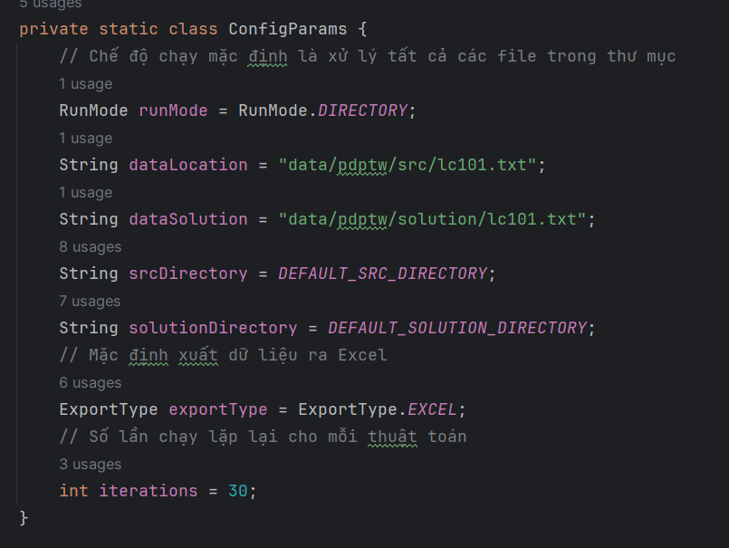

# 🚚 Logistic Algorithms Research

**Nghiên cứu và triển khai các thuật toán tối ưu trong lĩnh vực logistics, hướng đến xây dựng hệ thống vận hành thông minh và hiệu quả.**

---

## 📌 Giới thiệu

Trong kỷ nguyên số hóa và thương mại điện tử bùng nổ, logistics đóng vai trò then chốt trong việc đảm bảo chuỗi cung ứng hoạt động trơn tru. Dự án này tập trung vào việc nghiên cứu và áp dụng các thuật toán tối ưu để giải quyết những thách thức phức tạp trong logistics, từ đó góp phần nâng cao hiệu quả và khả năng cạnh tranh của các doanh nghiệp.

---

## 🎯 Mục tiêu

- **Nghiên cứu thuật toán tối ưu**: Tìm hiểu và áp dụng các thuật toán như tìm đường đi ngắn nhất, phân phối hàng hóa tối ưu, lập lịch vận chuyển hiệu quả.
- **Triển khai bằng Java**: Sử dụng ngôn ngữ Java để đảm bảo tính linh hoạt, hiệu suất và khả năng mở rộng.
- **Xây dựng cấu trúc dự án chuẩn hóa**: Thiết kế kiến trúc phần mềm rõ ràng, dễ bảo trì và phù hợp với các tiêu chuẩn công nghiệp.
- **Mở rộng và tích hợp**: Tạo điều kiện để tích hợp với các hệ thống khác và mở rộng chức năng trong tương lai.

---

## 🧠 Công nghệ sử dụng

- **Ngôn ngữ lập trình**: Java
- **Quản lý dự án**: Maven
- **Kiến trúc dự án**: Tuân theo mô hình chuẩn với cấu trúc thư mục rõ ràng, dễ hiểu.

---

## 📁 Cấu trúc dự án

```bash
logistic/
├── .idea/                   # Cấu hình IDE
├── src/
│   └── main/
│       └── java/
│           └── org/
│               └── logistic/
│                   └── algorithm/  # Các thuật toán được triển khai tại đây
│                       ├── aco/
│                       ├── sho/
│                       ├── gwo/
│                       └── sa/
│                   └── annotation/ # Cấu hình AOP cho log
|                   └── config/   # Cấu hình Spring
|                   └── aspect/   # Tổ chức ghi log
|                   └── model/    # Các đối tượng chung
|                   └── data/     # Đọc dữ liệu 
|                   └── util/     # Hỗ trợ chung 
├── pom.xml                  # Tệp cấu hình Maven
└── README.md                # Tệp giới thiệu dự án
```

## 🚀 Khởi động dự án

### 1. Clone dự án
```agsl
git clone https://github.com/khainam23/logistic.git
cd logistic\src\main
```

### 2. Tạo các file cần thiết 
```agsl
mkdir resources
```

### 3. Tải data
Truy cập [Data for Logistic](https://github.com/khainam23/logistic/blob/data/data.zip) và tải vào thư mục **resources**

### 4. Mở dự án bằng IDE
- Cài đặt các lib tại file ***pom.xml***.
- Chạy dự án ở file ***Main.java***
- Hãy điều chỉnh các thông số mà bạn muốn tại 


## 🛠️ Đóng góp
Chúng tôi luôn chào đón sự đóng góp từ cộng đồng. Nếu bạn quan tâm đến lĩnh vực logistics và có ý tưởng hoặc cải tiến.

## 📬 Liên hệ
Nếu bạn có bất kỳ câu hỏi hoặc đề xuất nào, vui lòng mở một Issue hoặc liên hệ trực tiếp với chúng tôi qua email: khainam23@example.com

## 🌟 Ghi chú
Dự án này là một phần trong hành trình khám phá và ứng dụng công nghệ vào lĩnh vực logistics. Chúng tôi tin rằng, với sự chung tay của cộng đồng, chúng ta có thể tạo ra những giải pháp đột phá, góp phần nâng cao hiệu quả và bền vững cho chuỗi cung ứng toàn cầu.
